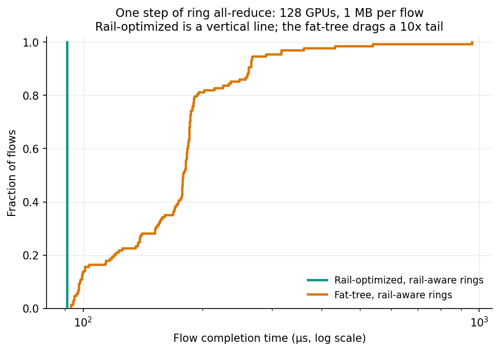
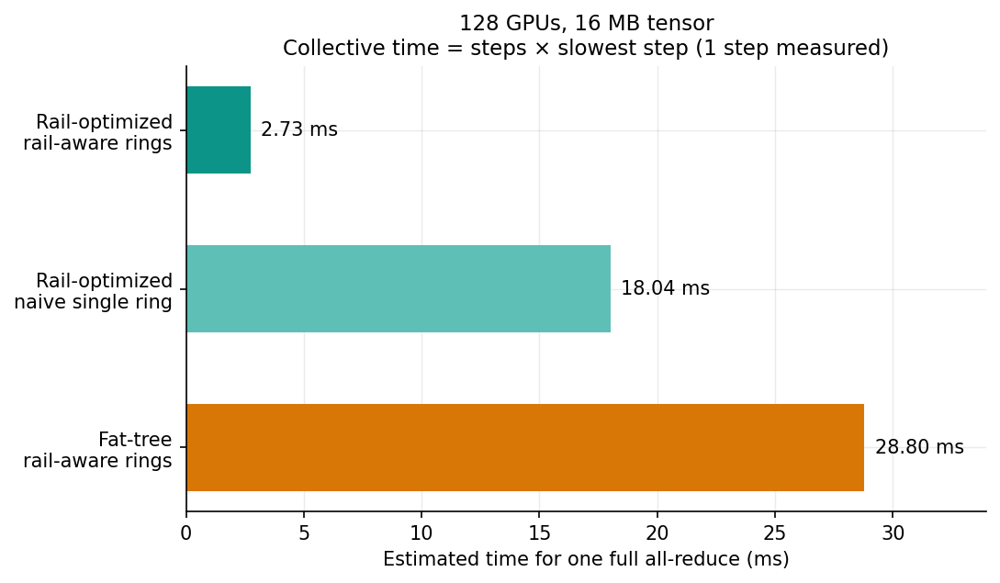
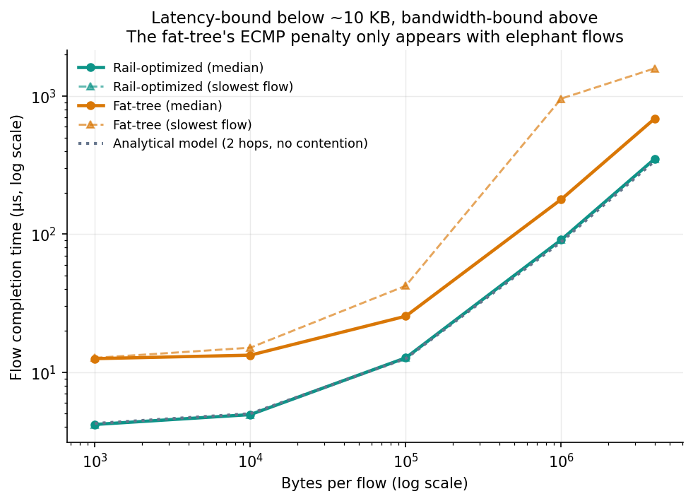

# RDMA/RoCE GPU Cluster Network Fabric Simulator

> A learning project. I wanted to understand how network design affects AI training performance, so I built a testbed that lets me change the topology with a command-line flag and measure what happens.



---

## Why I built this

Training a large model means thousands of GPUs exchanging gradients dozens of times per second. If the network stalls, the GPUs idle — and idle GPUs are the largest cost line in an AI cluster. That makes fabric design a genuinely expensive engineering decision, and it is a corner of networking I had no hands-on experience with.

Rather than read about it, I wanted to measure it. Two topologies dominate the space:

- **Fat-tree** — the general-purpose datacenter design. Many equal-cost paths between any two hosts, load-balanced by ECMP hashing.
- **Rail-optimized** — purpose-built for AI (NVIDIA DGX SuperPOD). Each GPU has its own NIC, and GPU *rank* r in every server connects to a dedicated "rail" switch r.

The question I set out to answer: **for a realistic AI training workload, how much does the choice actually matter, and why?**

## What I actually built

The packet simulator is not mine. It is the [Alibaba HPCC fork of ns-3](https://github.com/alibaba-edu/High-Precision-Congestion-Control), published alongside the HPCC paper (SIGCOMM 2019), which implements RoCEv2 queue pairs, DCQCN, PFC, ECN and a Broadcom shared-buffer switch model.

What I wrote is everything around it:

| Component | What it does |
|---|---|
| `Dockerfile` | Reproducible build of ns-3.18 + the HPCC fork. One command, works on Apple Silicon. |
| `topo/fat_tree.py` | Generates a k-ary fat-tree of any size in HPCC's topology format |
| `topo/rail_optimized.py` | Generates a rail-optimized fabric (servers × GPUs × rails + spines) |
| `traffic/allreduce.py` | Ring all-reduce traffic, rail-aware or deliberately rail-oblivious |
| `traffic/incast.py` | Synchronized many-to-one incast |
| `experiments/run.py` | Turns one command line into a complete, reproducible experiment |
| `analysis/` | Flow-completion statistics and the figures below |

Roughly 900 lines of Python. The interesting part was not the code volume — it was working out what a fair experiment looks like.

## What the experiments showed

All runs: 128 GPUs, one step of ring all-reduce, 100 Gbps links, DCQCN congestion control.

**Rail-optimized removed all variance.** Every one of 128 flows finished in exactly 91.0 µs — 1.03× the theoretical floor. On the fat-tree, the median was 178.7 µs but the worst flow took 959.9 µs, **10.4× slower than it should have been**.

| Fabric | median | p99 | worst | worst slowdown |
|---|---|---|---|---|
| Rail-optimized | 91.0 µs | 91.0 µs | 91.0 µs | 1.03× |
| Fat-tree | 178.7 µs | 539.0 µs | 959.9 µs | 10.42× |

**Ring ordering mattered as much as the hardware.** Running the same collective on the same rail-optimized fabric, but ordering the ring naively (0 → 1 → 2 → …), made every hop cross-rail and forced traffic up to the spine tier. Estimated collective time went from 2.73 ms to 18.0 ms — 6.6× worse, from software alone.



**The advantage only appears with large messages.** Sweeping flow size from 1 KB to 4 MB, the fat-tree's penalty is invisible below ~10 KB and severe above ~1 MB. Real gradient tensors are megabytes.



| Bytes per flow | Rail median | Fat-tree median | Fat-tree worst |
|---|---|---|---|
| 1 KB | 4.2 µs | 10.6 µs | 12.7 µs |
| 100 KB | 12.7 µs | 25.4 µs | 42.2 µs |
| 1 MB | 91.0 µs | 178.7 µs | 959.9 µs |
| 4 MB | 352.0 µs | 689.0 µs | 1.59 ms |

## What I learned

The measurements are the evidence; these are the things I actually came away understanding.

**Rail-optimized wins by removing path choice, not by shortening paths.** This surprised me — I expected the benefit to be about hop count. It is not. When same-rank GPUs share a rail switch, there is exactly *one* route between them, so ECMP has nothing to hash and two flows physically cannot be assigned to the same link by accident. The zero variance is structural, not statistical.

**ECMP is great for many small flows and bad for a few large ones.** Hashing distributes well when there are thousands of flows to average over. AI training produces a handful of enormous ones, so a collision doesn't average out — it halves the throughput of both flows for the entire transfer.

**Tail latency is the only number that matters for a collective.** A collective finishes when its *slowest* member finishes, so 127 fast flows and one straggler is exactly as bad as 128 slow ones. This reframed how I read every result.

**There are two distinct regimes.** Below ~10 KB, completion time is round-trip propagation and hop count decides. Above ~100 KB, it is bytes divided by bandwidth and contention decides. Almost every intuition flips between them, and AI training lives firmly in the second.

**Good congestion control makes the emergency brake unnecessary.** PFC never fired in any run. DCQCN reacts to ECN marks and throttles senders before switch buffers are ever in danger. PFC only exists for when that fails — and PFC storms are the classic way production RoCE deployments fall over.

**Sanity-check simulator output against arithmetic.** Bytes divided by bandwidth, hops times delay. If the tool disagrees with physics, the tool is being misused.

## Things that went wrong

Worth recording, because the debugging was most of the learning.

**The build.** The HPCC fork is a 2018-era research codebase. Its build system needs Python 2, which Ubuntu 20.04 no longer provides as `python`, so `./waf configure` died twice with increasingly obscure errors before I pinned Python 2 alongside Python 3 in the image.

**A units bug that invalidated my first two experiments.** HPCC reads flow size into a variable named `maxPacketCount`, so my generator divided byte counts by the packet size. The results looked plausible until I checked them: a "10 MB" transfer was finishing in 12 µs, which is faster than a 100 Gbps link can physically move 10 MB. The field is actually wired to an attribute documented as *"the number of bytes to write."* Fixed in [`ad2e414`](../../commit/ad2e414); the first two runs were silently 1000× too small.

**A plot that lied.** My first CDF put all three configurations on one axis — but the naive-ring run splits its tensor 128 ways instead of 16, so its flows are 125 KB against 1 MB. The slowest configuration appeared fastest. Raw completion time is only comparable between runs with the same flow size, so that plot now shows only the two matched configurations.

## Limitations

- **One step measured, full collective extrapolated** as `steps × slowest step`. Real collectives have per-step barriers and jitter this does not capture.
- **No intra-node modelling.** NVLink and the intra-server phases of an all-reduce are outside the simulation, so these are not end-to-end training times.
- **Switch radix differs between the fabrics.** Host count and link rate are matched; port cost is not.
- **No real-hardware validation.** The obvious next step is `nccl-tests` on a rented multi-GPU instance.
- **One congestion-control algorithm** in the headline results. HPCC, TIMELY and DCTCP are compiled in but not swept.

More reasoning behind each design choice is in [docs/DESIGN-NOTES.md](docs/DESIGN-NOTES.md).

## Running it

Requires Docker. On Apple Silicon, enable **Settings → General → Use Rosetta for x86/amd64 emulation**.

```bash
docker build -t rdma-sim .
```

```bash
docker run -it --rm -v "$PWD":/work rdma-sim bash
```

Inside the container:

```bash
python3 -m experiments.run --topo rail --n-servers 16 --gpus-per-server 8 --traffic ring-allreduce --tensor-size 16000000 --ring-mode parallel --sim-time 2.05 --no-packet-trace --name my-run
```

```bash
bash experiments/sweep.sh && python3 -m analysis.plots
```

```bash
python3 -m analysis.fct_stats results/*/fct.txt
```

Build takes about 4 minutes. A 128-GPU all-reduce step simulates in 12–30 seconds.

## Layout

```
topo/          topology generators + HPCC topology.txt writer
traffic/       traffic patterns + HPCC flow.txt writer
experiments/   orchestrator and sweep driver
analysis/      statistics and figures
docs/          design notes
plots/         committed figures
results/       simulation output (gitignored)
Dockerfile     ns-3.18 + HPCC RDMA fork, pinned
```

